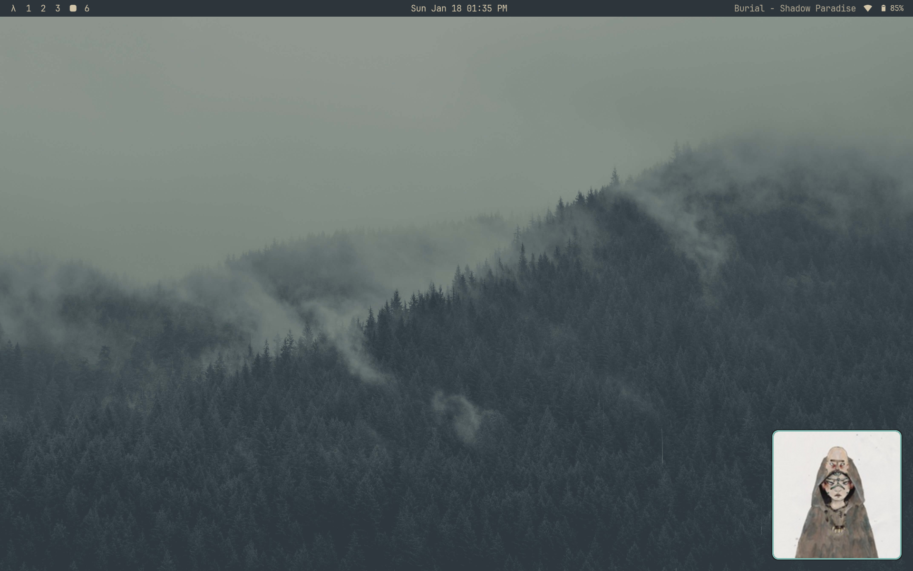

# Sleevie

A floating "now playing" widget for Linux, inspired by [Sleeve](https://replay.software/sleeve) for macOS.

Built with [AGS](https://github.com/Aylur/ags) (Aylur's GTK Shell) using GTK4 and the Astal libraries.



## Features

- Floating album art display with rounded corners
- Draggable window (Super + left mouse button)
- Three size options: small (150px), medium (200px), large (300px)
- Minimize to a compact bar, maximize back to full artwork
- Smart corner anchoring - stays pinned to nearest corner when resizing
- Hover to reveal playback controls and window controls
- Two-line track info: song title (bold) and artist • album
- Keyboard shortcuts for all controls
- Works with any MPRIS-compatible player (Spotify, browsers, VLC, etc.)
- Pinned to all workspaces

## Requirements

- AGS 3.x (built from source)
- Astal libraries (astal-io, astal4, astal-mpris)
- GTK4
- Hyprland (for window rules and positioning)

## Running

```bash
./run.sh
```

Or manually:

```bash
export LD_LIBRARY_PATH="/usr/local/lib:$LD_LIBRARY_PATH"
export GI_TYPELIB_PATH="/usr/local/lib/girepository-1.0:$GI_TYPELIB_PATH"
ags run .
```

## Hyprland Setup

Add these window rules to your Hyprland config for the best experience:

```conf
windowrulev2 = float, class:io.Astal.sleevie
windowrulev2 = noborder, class:io.Astal.sleevie
windowrulev2 = noshadow, class:io.Astal.sleevie
windowrulev2 = pin, class:io.Astal.sleevie
```

## Keyboard Shortcuts

When the widget is focused:

| Key | Action |
|-----|--------|
| `Space` / `K` | Play/Pause |
| `Left` / `J` | Previous track |
| `Right` / `L` | Next track |
| `M` | Minimize/Maximize |
| `S` | Cycle size (small → medium → large) |
| `Q` / `Escape` | Quit |

## Customization

Edit `style.scss` to customize:

- `$art-size`: Album art dimensions (default: 200px)
- `$mini-height`: Minimized bar height (default: 40px)
- `$border-radius`: Corner rounding (default: 8px)
- `$fg-color`: Text color

Edit `widget/Sleeve.tsx` to change:

- Window size constants (`ART_SIZE`, `MINI_HEIGHT`)
- Marquee scroll speed and width
- Initial position in `run.sh`

## Project Structure

```
sleevie/
├── app.ts           # Entry point
├── style.scss       # Styles
├── widget/
│   └── Sleeve.tsx   # Main widget component
├── @girs/           # TypeScript type definitions
└── run.sh           # Helper script with auto-positioning
```

## Credits

Inspired by [Sleeve](https://replay.software/sleeve) by Replay Software.
